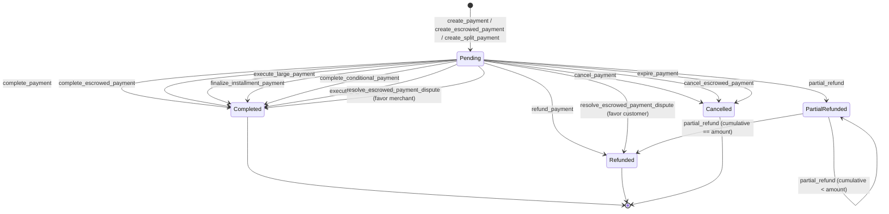

# Payment Contract

## Payment Lifecycle State Diagram

A payment moves through five possible states. `Completed`, `Refunded`, and `Cancelled` are **terminal** — once reached, no further transitions are possible.

### States

| State | Description |
|---|---|
| **Pending** | Initial state after creation. Awaiting completion, refund, cancellation, or expiration. |
| **Completed** | Payment finalized — funds transferred to the merchant (or split recipients). Terminal. |
| **Refunded** | Full refund issued to the customer. Terminal. |
| **PartialRefunded** | A portion of the payment has been refunded. Can receive additional partial refunds until the cumulative refund equals the payment amount, at which point it transitions to **Refunded**. |
| **Cancelled** | Payment cancelled by customer/merchant or expired. Terminal. |

### Transitions

#### Creation (sets initial state to `Pending`)

| Function | Access Control | Notes |
|---|---|---|
| `create_payment` | Customer | Standard payment creation. |
| `create_escrowed_payment` | Customer | Creates payment + links to an escrow contract. |
| `create_split_payment` | Customer | Creates payment with split recipient configuration. |

#### `Pending` → `Completed`

| Function | Access Control | Notes |
|---|---|---|
| `complete_payment` | Admin (multisig) | Standard completion. Large payments may require multisig approval via `execute_large_payment`. |
| `complete_escrowed_payment` | Admin (multisig) | Completes an escrowed payment after escrow release succeeds. |
| `execute_large_payment` | Anyone (permissionless) | Executes a large payment once the multisig proposal has enough approvals. |
| `finalize_installment_payment` | Anyone (permissionless) | Automatically called when the last installment is paid. |
| `complete_conditional_payment` | Admin (multisig) | Completes if the on-chain condition evaluates to true. |
| `execute_if_condition_met` | Anyone (permissionless) | Same as above, but permissionless. |
| `resolve_escrowed_payment_dispute` | Admin (multisig) | When resolved in favor of the merchant (`favor_customer = false`). |

#### `Pending` → `Refunded`

| Function | Access Control | Notes |
|---|---|---|
| `refund_payment` | Admin (multisig) | Full refund. |
| `resolve_escrowed_payment_dispute` | Admin (multisig) | When resolved in favor of the customer (`favor_customer = true`). |

#### `Pending` / `PartialRefunded` → `PartialRefunded` / `Refunded`

| Function | Access Control | Notes |
|---|---|---|
| `partial_refund` | Admin (multisig) | Refunds a portion. If cumulative refunds equal the payment amount, transitions to **Refunded**. |

#### `Pending` → `Cancelled`

| Function | Access Control | Notes |
|---|---|---|
| `cancel_payment` | Customer or Merchant | Voluntary cancellation. |
| `cancel_escrowed_payment` | Customer or Merchant | Cancels escrowed payment and invokes escrow refund. |
| `expire_payment` | Anyone (permissionless) | Permissionless — triggers when `current_timestamp > expires_at`. Automatically refunds tokens to the customer. |

### Access Control Summary

| Caller | Functions |
|---|---|
| **Customer** | `create_payment`, `create_escrowed_payment`, `create_split_payment`, `pay_installment` |
| **Customer or Merchant** | `cancel_payment`, `cancel_escrowed_payment`, `dispute_escrowed_payment` |
| **Admin (multisig member)** | `complete_payment`, `complete_escrowed_payment`, `refund_payment`, `partial_refund`, `resolve_escrowed_payment_dispute`, `complete_conditional_payment`, `execute_split_settlement` |
| **Anyone (permissionless)** | `expire_payment`, `execute_if_condition_met`, `execute_large_payment` (once approvals met), `finalize_installment_payment` (once balance is 0) |
